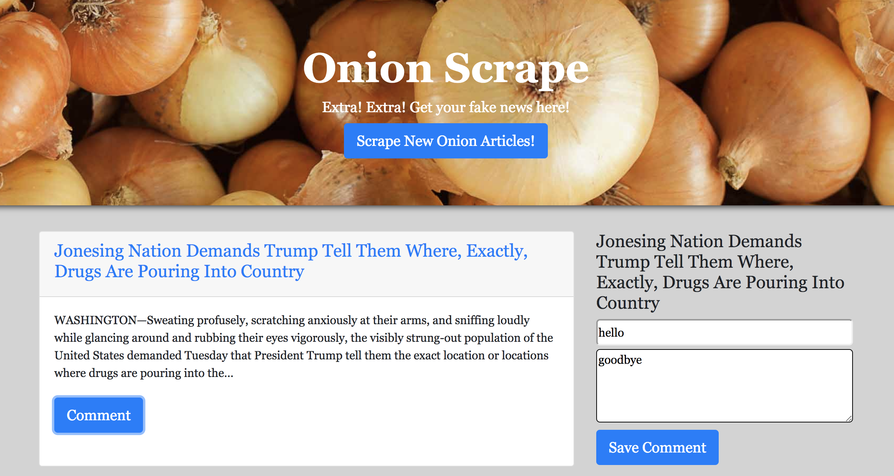

# Onion Scrape

## Current Limitations:
* A new scrape appends articles to the bottom of the list. I want to drop the collection first and then display a new scrape of articles, rather than add to the old list
* Does not display all comments - only the most current
* Delete button is not fully functioning

Experience here: [Onion Scrape](https://murmuring-sands-38119.herokuapp.com/)

Onion Scrape is a web-scraper application that scrapes all the latest articles from the Onion. Users can click the "Scrape New Onion Articles" button to display the most current articles, which include a clickable headline link, a short summary, and a "Comment" button.

User can click the "Comment" button and leave a comment that will be stored and viewable to any other users in the future.

**Tech Used:**

* JavaScript
* jQuery
* Handlebars
* Bootstrap
* MongoDB
* Mongoose
* Cheerio
* Axios
* Morgan

&nbsp;

Designed and maintained by Brian Fitzgerald

Email: brianjfitzgerald@gmail.com

Copyright &#169; 2018